---
## Front matter
lang: ru-RU
title: Лабораторная работа № 1
subtitle: Система контроля версий Git
author:
  - Мугари Абдеррахим
institute:
  - Российский университет дружбы народов, Москва, Россия
date: 19 февраля 2025

## i18n babel
babel-lang: russian
babel-otherlangs: english

## Formatting pdf
toc: false
toc-title: Содержание
slide_level: 2
aspectratio: 169
section-titles: true
theme: metropolis
header-includes:
 - \metroset{progressbar=frametitle,sectionpage=progressbar,numbering=fraction}
---

# Информация

## Преподаватель 

:::::::::::::: {.columns align=center}
::: {.column width="70%"}

  * Кулябов Дмитрий Сергеевич
  * д.ф.-м.н., профессор
  * профессор кафедры прикладной информатики и теории вероятностей
  * Российский университет дружбы народов
  * [kulyabov-ds@rudn.ru](mailto:kulyabov-ds@rudn.ru)
  * <https://yamadharma.github.io/ru/>

:::
::: {.column width="30%"}

:::
::::::::::::::

## Докладчик

:::::::::::::: {.columns align=center}
::: {.column width="70%"}

  * Мугари Абдеррахим
  * Студент третьего курса 
  * фундаментальная информатика и информационные технологии
  * Российский университет дружбы народов
  * [1032215692@rudn.ru](mailto:1032215692@rudn.ru)
  * <https://iragoum.github.io/>

:::
::: {.column width="30%"}

:::
::::::::::::::

# Цель работы

- Цель этой лабораторной работы это получить глубокое представление о том, как работает "git", его командах и сценариях, с которыми мы можем столкнуться при его использовании, а также о том, как их исправить.

## Установка имени и электронной почты

- Здесь мы должны добавить наше имя и адрес электронной почты, чтобы git теперь мог определить, кто является отправителем, этот шаг выполняется, если мы устанавливаем git впервые

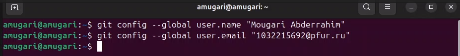{#fig:001 width=70%}

## Параметры установки окончаний строк

- Настройка core.autocrlf с параметрами true и input делает все переводы строк текстовых файлов в главном хранилище одинаковыми в случае, если в нашем хранилище есть несколько пользователей с разными операционными системами 

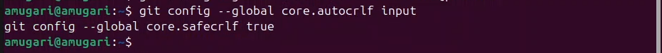{#fig:002 width=70%}

## Установка отображения unicode

- Поскольку git будет печатать символы, отличные от ASCII, в именах файлов в виде восьмеричных последовательностей \**nnn**, нам пришлось установить этот флаг, чтобы избежать проблемы с удобочитаемостью 

{#fig:074 width=70%}

## Создание страницы «Hello, World»

- Здесь мы создали пустую директорию с именем "hello", затем авторизуемся и создаем там файл с именем hello.html 

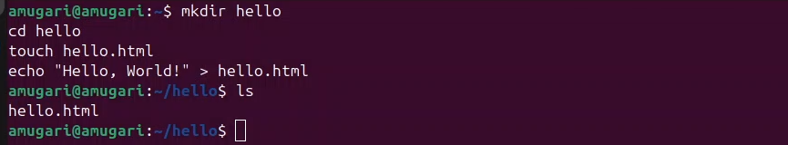{#fig:003 width=70%}

## Cоздание репозитория и обавление файла в репозитори

- После этого мы создали репозиторий и сделали в нем нашу первую фиксацию после добавления файла hello.html 

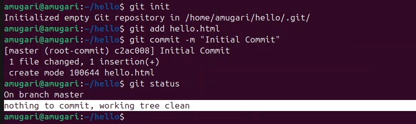{#fig:004 width=70%}

## Внесение изменений

- добавили несколько HTML-тегов к нашему приветствию. Изменили содержимое файла hello.html 

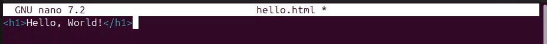{#fig:005 width=70%}

## Внесение изменений

- git знает, что файл hello.html был изменен, но при этом эти изменения еще не зафиксированы в репозитории 

## Внесение изменений

- вот почему мы добавили изменения в hello.html и они были проиндексированы. Это означает, что git в настоящее время знает об изменениях, но они еще не были зарегистрированы в репозитории. 

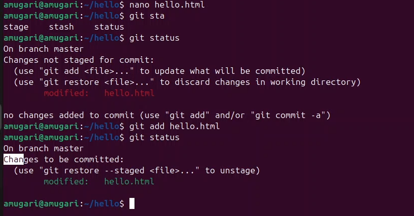{#fig:006 width=70%}

##  Коммит изменени

- мы убрали метку m из командной строки, git перенес нас в редактор по нашему выбору. мы выполнили фиксацию и проверили статус 

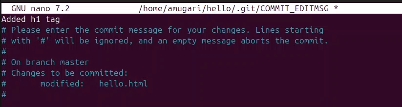{#fig:007 width=70%}

## добавление стандартных тегов страницы 

- мы изменили страницу "Привет, мир", чтобы она содержала стандартные теги <html> 

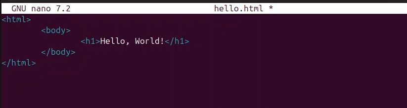{#fig:008 width=70%}

## добавление стандартных тегов страницы 

- затем добавил это изменение в индекс git 

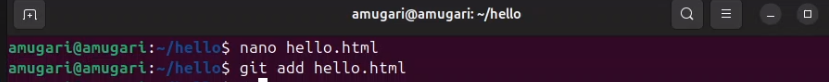{#fig:009 width=70%}

## добавление стандартных тегов страницы 

- затем добавил аголовки HTML (секцию <head>) к странице «Hello, World».

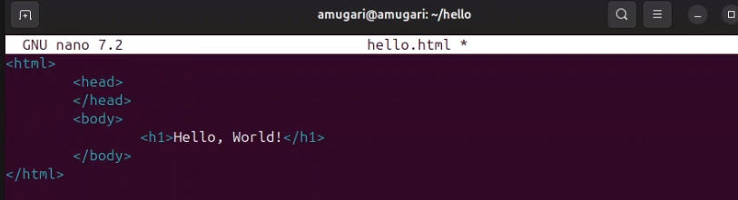{#fig:010 width=70%}

## добавление стандартных тегов страницы 

- здесь мы можем отметить, что hello.html он дважды указан в статусе. Первое изменение (добавление стандартных тегов) было проиндексировано и готово к фиксации. Второе изменение (добавление HTML-заголовков) не проиндексировано. и он должен быть проиндексирован, прежде чем сможет быть зафиксирован 

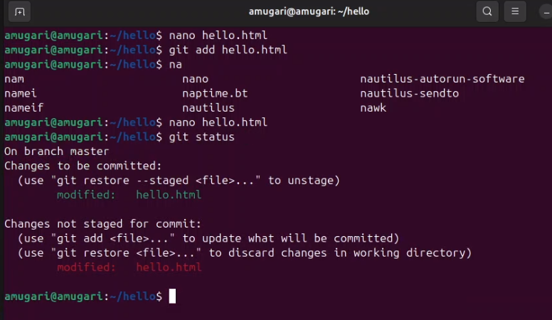{#fig:011 width=40%}

## добавление стандартных тегов страницы 

- вот почему мы зафиксировали индексированное изменение (значение по умолчанию), кроме того, я добавил второе изменение в индекс и проверил статус с помощью команды git status. 

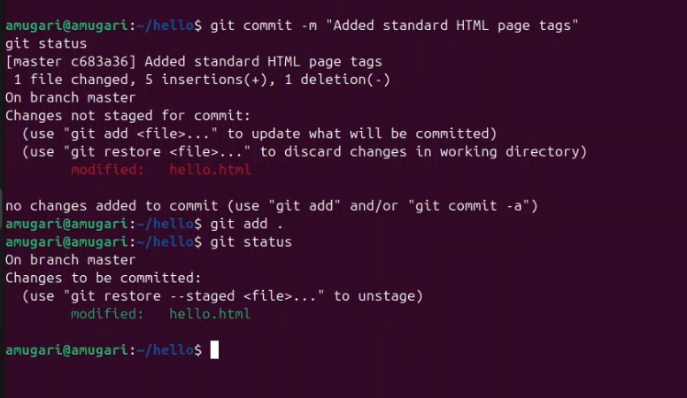{#fig:012 width=40%}

## История

- мы получили список внесенных изменений 

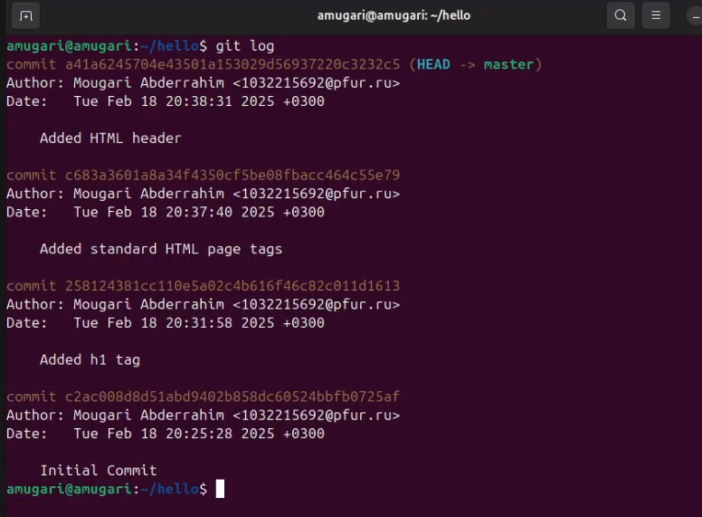{#fig:013 width=40%}

## Получение старых версий

- мы получили хэши предыдущих версий с помощью команды checkout , а затем мы вернулись во времени к первому коммиту 

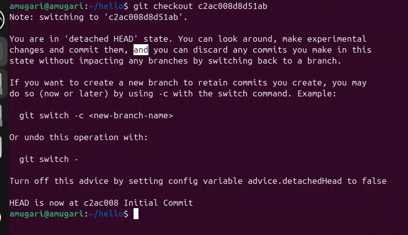{#fig:014 width=50%}

- затем, мы проверили файл hello.html и это выглядит так, как будто мы не вносили в него никаких изменений 

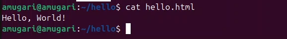{#fig:015 width=50%}

## Создание тегов версий

- Здесь мы создали новый тег для последней версии, а затем перешли к его родительской версии, которая была непосредственно предшествующей 

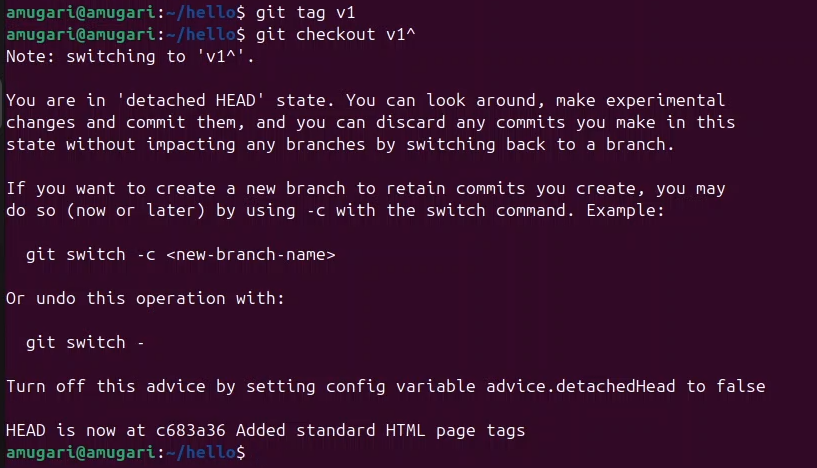{#fig:016 width=70%}

## Создание тегов версий

- в родительской версии мы проверили файл hello.html и там отсутствуют теги head, что правильно 

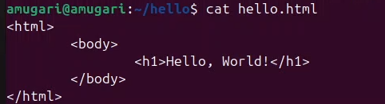{#fig:017 width=70%}

## Создание тегов версий

- мы назвали эту версию v1-бета-версией 

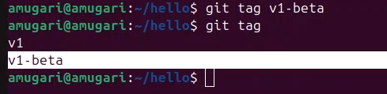{#fig:018 width=70%}

## Создание тегов версий

- мы можем видеть теги (v1 и v1-бета) в журнале вместе с названием ветки (master).
Кроме того, в заголовке отображается коммит, на который вы перешли (на данный
момент это v1-бета). 

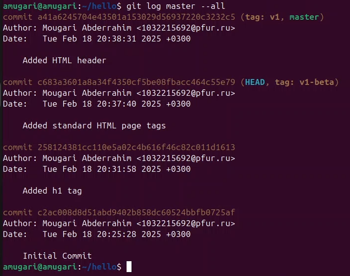{#fig:019 width=40%}

## Отмена локальных изменений (до индексации)

- Внес изменения в файл hello.html в виде нежелательного комментария 

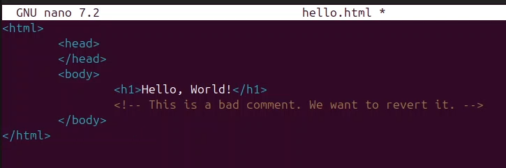{#fig:020 width=70%}

## Отмена локальных изменений (до индексации)

- Мы проверели статус каталога ,hello.html он был изменен, но не проиндексирован

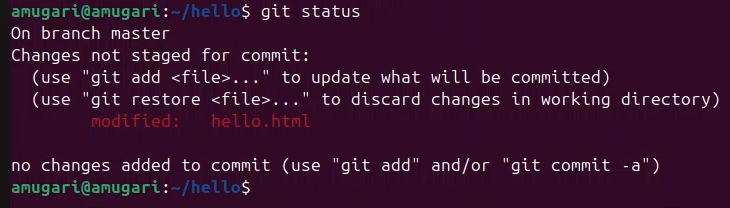{#fig:021 width=70%}

## Отмена локальных изменений (до индексации)

- Используя команду git checkout, мы изменили версию файла. hello.html в репозитории а команда "статус" подтверждает, что изменения были отменены и ожидающие изменения недоступны

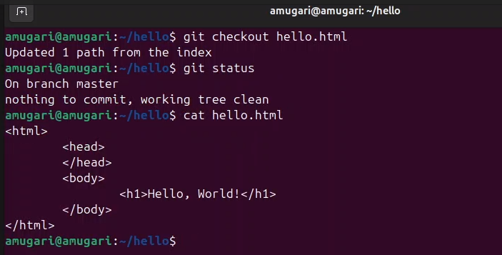{#fig:022 width=50%}

## Oтмена проиндексированных изменений (перед коммитом

- Внес изменения в файл hello.html в виде нежелательного комментария

{#fig:023 width=70%}

## Oтмена проиндексированных изменений (перед коммитом

- но в данном случае мы проиндексировали это изменение, но не выполнили фиксацию 

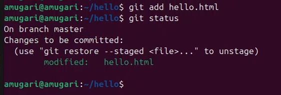{#fig:024 width=70%}

## Oтмена проиндексированных изменений (перед коммитом

- Команда git reset сбрасывает буферную зону к HEAD. Это очищает буферную
зону от изменений, которые мы только что проиндексировали 

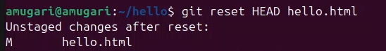{#fig:025 width=70%}

## Oтмена проиндексированных изменений (перед коммитом

- Наш рабочий каталог опять чист .

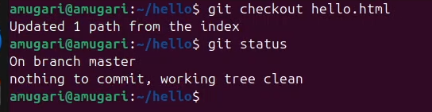{#fig:026 width=70%}

## Отмена коммитов

- Внес изменения в файл hello.html в виде нежелательного комментария 

{#fig:027 width=70%}

## Отмена коммитов

- я проиндексировал изменения и выполнил commit в репозитории 

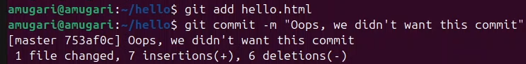{#fig:028 width=70%}

## Отмена коммитов

- мы отменили самую последнюю фиксацию, мы смогли использовать HEAD в качестве аргумента для отмены. 

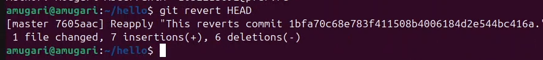{#fig:029 width=70%}

## Удаление коммиттов из ветки
 
- отметил последнюю коммит тегом , чтобы мы могли найти ее позже 
 
 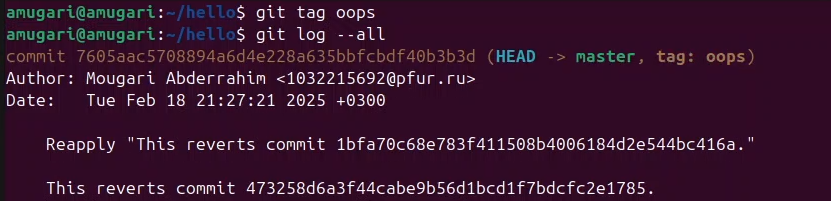{#fig:030 width=70%}
 
## Удаление коммиттов из ветки
 
- восстановил ветку до этого состояния. Поскольку у ветки есть тег, мы использовали название тега в команде сброса 

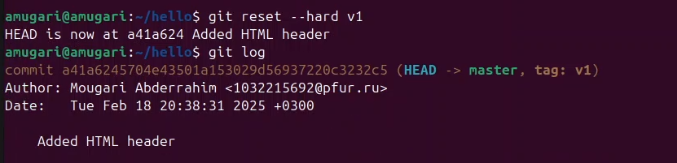{#fig:031 width=70%}

## Удаление коммиттов из ветки
 
- Kоммиты все еще находятся в репозитории. 
 
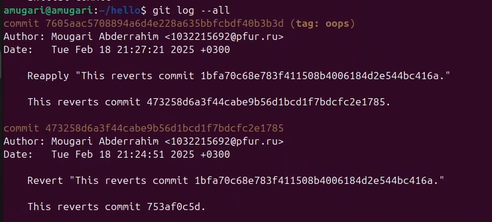{#fig:032 width=70%}
 
## Удаление тега oops
 
- мы удалили коммит и тег, на который он ссылался, с помощью сборщика мусора 
 
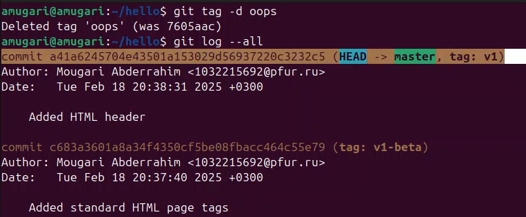{#fig:033 width=70%}
 
## Внесение изменений в коммиты
 
- здесь мы изменили страницу, а затем выполнили commit. затем мы захотели добавить email к предыдущему commit, поэтому мы используем опцию --amend, чтобы сделать это, как показано на рисунке 
 
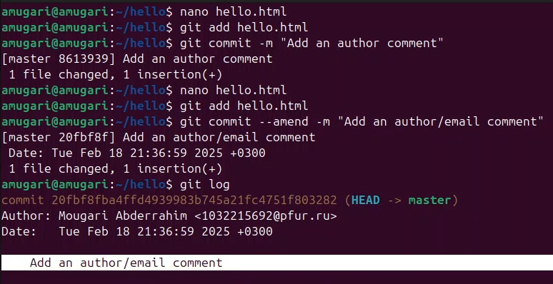{#fig:034 width=50%}
   
## Перемещение файлов

- здесь мы создали новый каталог lib и, используя команду git mv, смогли не только переместить файл hello.html но и немедленно проиндексировать изменения, после чего мы выполнили фиксацию 

{#fig:035 width=70%}

## Добавление index.html

- Добавил файл index.html в наш репозиторий 

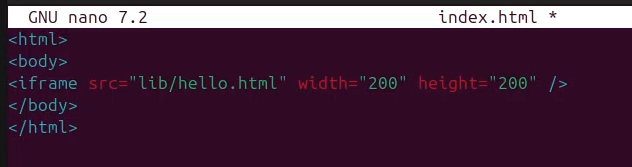{#fig:036 width=70%}

## Добавление index.html

- и вот как сейчас выглядит наша страница 

{#fig:037 width=40%}

## Git внутри: Каталог .git

- используя первую команду, мы открываем каталог, где хранится вся информация, они ввели объекты, где мы нашли каталоги, которые состоят из 2 символов. -
на этот раз они оказываются первыми двумя буквами хэша объекта, расположенного в git, после чего мы выбрали один из них и Я ввел его и нашел файл с названием из 38 символов, информация в нем сжата и закодирована, поэтому просмотр их содержимого нам мало чем поможет 

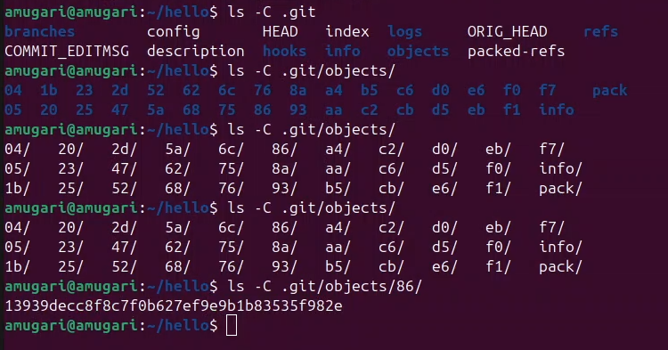{#fig:038 width=40%}

## Git внутри: Каталог .git

-мы проверили конфигурационный файл, который создается для каждого проекта и еще смогли найти теги, ветки и head git, в нашем случае у нас есть только одна ветка **master** 

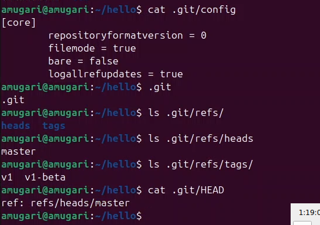{#fig:039 width=40%}

## Работа непосредственно с объектами git

- мы получили последнюю фиксацию в репозитории 

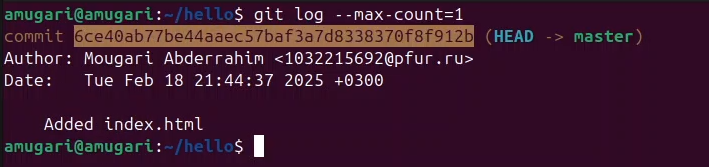{#fig:040 width=70%}

## Работа непосредственно с объектами git

- затем мы получили последнюю фиксацию, но с использованием хэша SHA1 

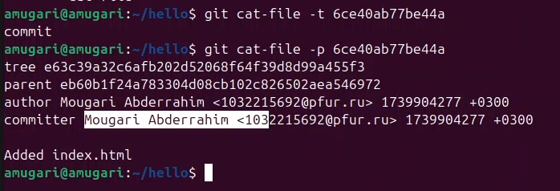{#fig:041 width=70%}

## Работа непосредственно с объектами git

- затем мы отобразили дерево каталогов, ссылка на который идет в коммите. 

{#fig:042 width=70%}

## поиск исходного файла hello.html

- затем мы автоматически начали поиск исходного файла hello.html , это был итерационный процесс, и после некоторого поиска мы добрались до исходного файла 

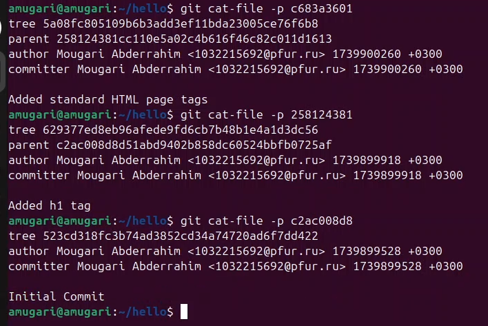{#fig:043 width=40%}

## Создание ветки

- здесь мы создали новую ветку под названием style 

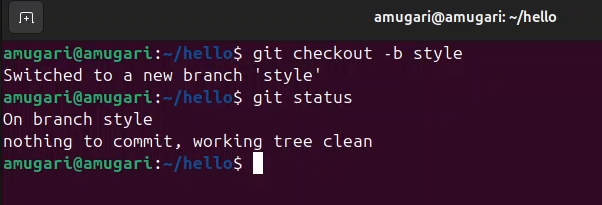{#fig:044 width=70%}

## Создание ветки

- затем мы создали новый файл для таблицы стилей style.css, после чего проиндексировали изменения и выполнили фиксацию 

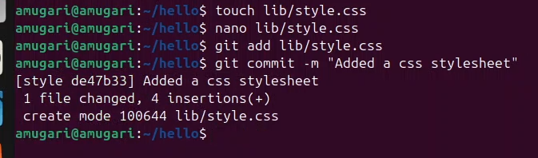{#fig:045 width=70%}

## Создание ветки

- мы обновили файл hello.html, чтобы использовать стили style.css 

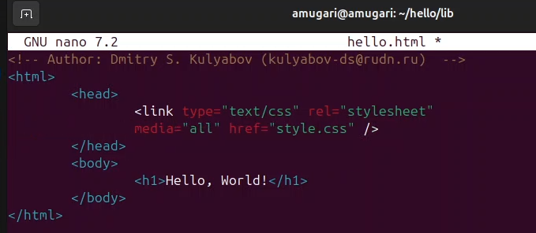{#fig:046 width=70%}

## Создание ветки

- затем мы обновили файл index.html так, чтобы он также использовал style.css, и, проверяя историю, мы можем видеть, что все коммиты находятся в ветке style.

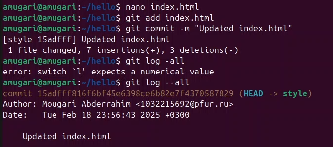{#fig:047 width=70%}

## Создание ветки

- мы перешли в ветку master и прочитали файл hello.html мы заметили, что в этой ветке не было внесено никаких изменений (файл hello.html не использует стили style.css.) 

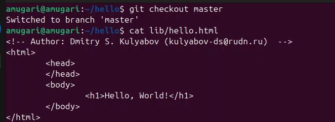{#fig:048 width=70%}

## Изменения в ветке master

- мы создали файл README.md в ветке master, проиндексировали изменения и выполнили commit 

{#fig:049 width=70%}

## Просмотр отличающихся веток

- Теперь у нас в репозитории есть две отличающиеся ветки.  которые не связаны и не обновляются друг с другом 

## Просмотр отличающихся веток

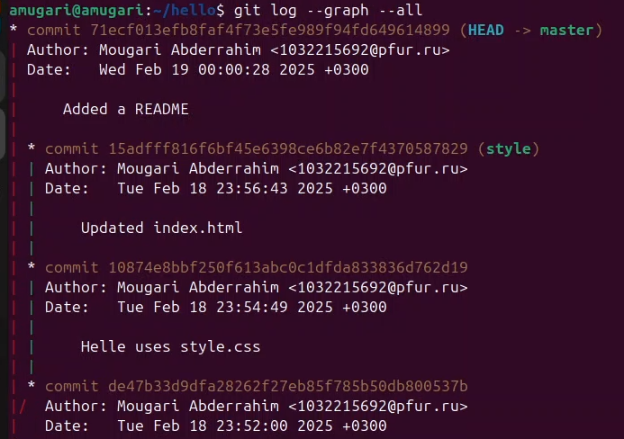{#fig:050 width=70%}

## Cлияние веток

- здесь мы объединили ветку "master" с веткой "style" 

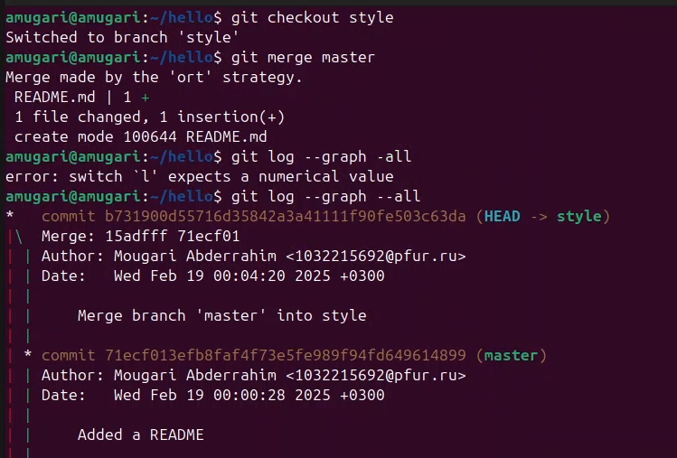{#fig:051 width=50%}

## Создание конфликта

- но, делая cлияние, мы иногда можем столкнуться с конфликтами, например, мы вернулись к основной ветке и изменили содержимое hello.html проиндексировали изменения и выполнили commit, что вызвало конфликт между двумя ветвями 

## Создание конфликта

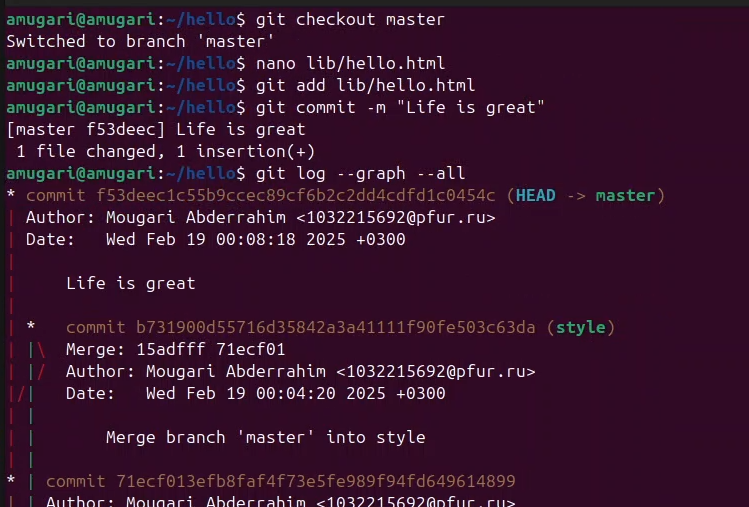{#fig:052 width=70%}

## Разрешение конфликтов

- Мы попытались объединить ветку `master` с веткой `style`, но столкнулись с конфликтом в файле `hello.html`. Git не смог автоматически выполнить слияние, так как обе ветки содержат изменённые версии этого файла. В результате содержимое `hello.html` теперь содержит конфликтующие блоки кода (

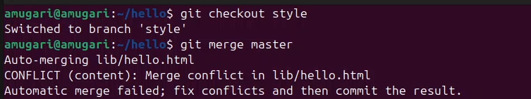{#fig:053 width=70%}

## Разрешение конфликта вручную

- Открываем файл `hello.html`, в котором Git пометил конфликтные участки.

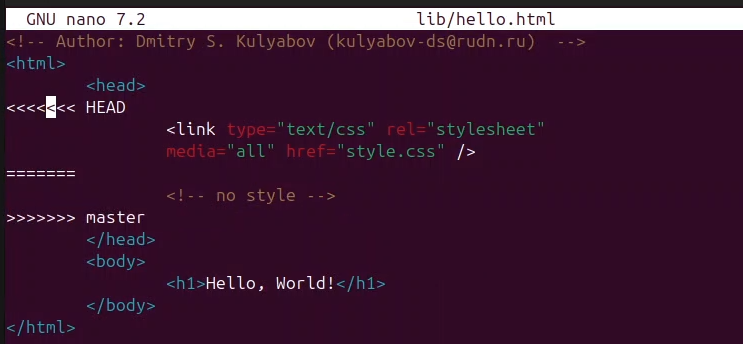{#fig:054 width=70%} 

## Разрешение конфликта вручную

- Мы выбираем, какие изменения оставить, а какие удалить, чтобы получить корректную версию файла.
- После внесения правок сохраняем файл и добавляем его в индекс с помощью `git add`. 
- Проверяем статус репозитория (`git status`), чтобы убедиться, что конфликт разрешён

## Завершение слияния

- После успешного разрешения конфликта выполняем коммит (`git commit -m "Merged master, resolved conflict"`).
- Проверяем историю коммитов (`git log --graph --all`), чтобы убедиться, что слияние завершено 

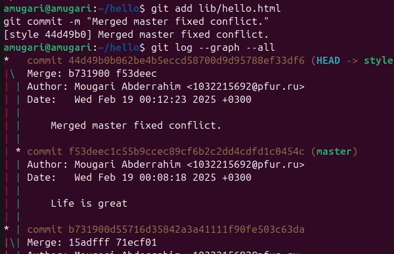{#fig:055 width=40%}

## Сброс ветки style  

- Возвращаем ветку `style` к состоянию перед слиянием (`git reset --hard`) 

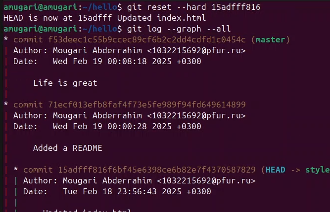{#fig:056 width=40%}

## Сброс ветки master  

- Возвращаем ветку `master` к предыдущему состоянию, чтобы избежать конфликтов

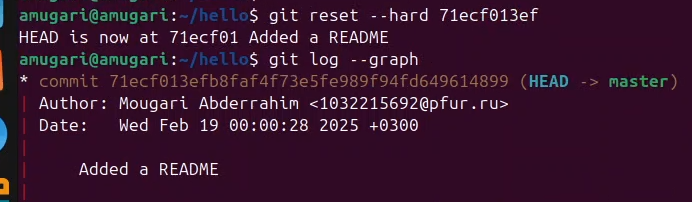{#fig:057 width=70%}

## Перебазирование  

- Выполняем `git rebase master`, чтобы применить изменения `master` к `style` 

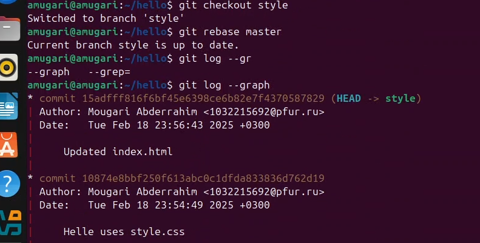{#fig:058 width=70%}

## Слияние в ветку master  

- Завершаем процесс слиянием `style` в `master` (`git merge style`) 

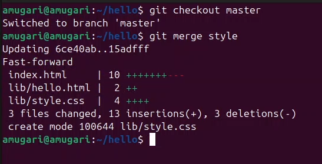{#fig:059 width=70%}

## Слияние в ветку master  

- росмотрили логи 

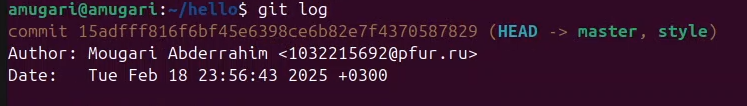{#fig:060 width=70%}

## Клонирование репозитория  

- Создаём копию репозитория с `git clone` 

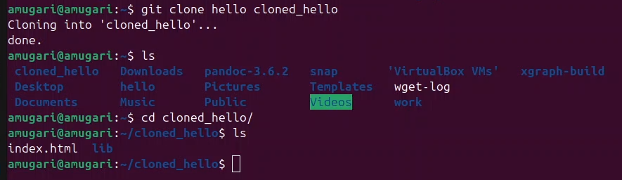{#fig:061 width=70%}

## Изменение оригинального репозитория  

- Вносим изменения в `README.md` и коммитим их 

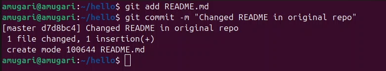{#fig:062 width=70%}

## Извлечение и слияние изменений  

- Используем `git fetch` и `git merge` для обновления локальной версии 

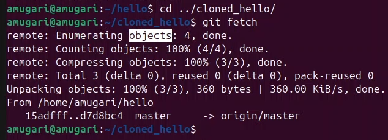{#fig:063 width=70%}

## Добавление ветки наблюдения  

- Настраиваем отслеживание удалённой ветки (`git branch --track`) 

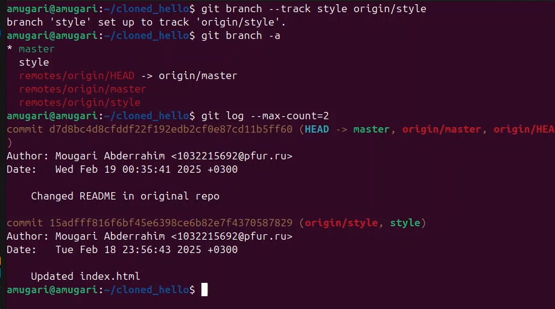{#fig:064 width=70%}

## Чистый репозиторий  

- Создаём чистый репозиторий (`git clone --bare`)

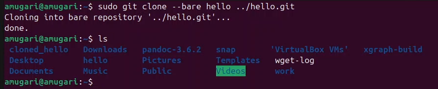{#fig:065 width=70%}

## Работа с удалёнными репозиториями  

- Добавляем удалённый репозиторий и отправляем изменения (`git push`) .

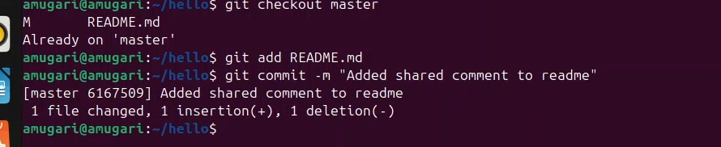{#fig:066 width=70%}

## Извлечение изменений из общего репозитория  

- Используем `git pull` для синхронизации (`git remote add shared`)

## Извлечение изменений из общего репозитория  

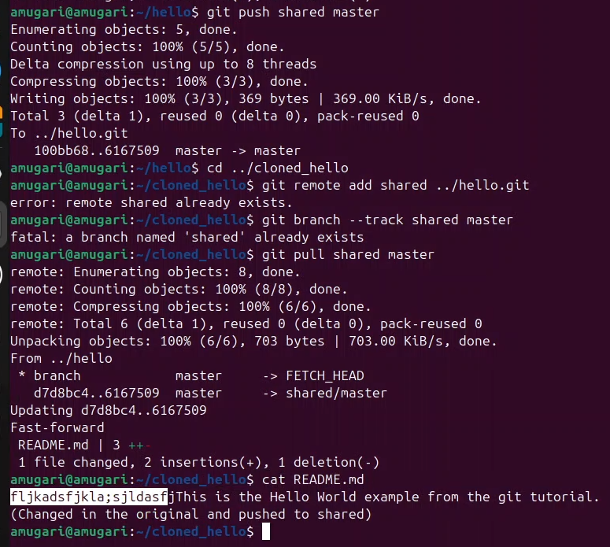{#fig:067 width=50%}

## Выводы

- в этой лабораторной работе мы получили глубокое представление о том, как работает git, его командах и сценариях, с которыми мы можем столкнуться при его использовании, а также о том, как их исправить. 

