---
## Front matter
title: "Лабораторная работа № 1"
subtitle: "Система контроля версий Git"
author: "Мугари Абдеррахим"

## Generic otions
lang: ru-RU
toc-title: "Содержание"

## Bibliography
bibliography: bib/cite.bib
csl: pandoc/csl/gost-r-7-0-5-2008-numeric.csl

## Pdf output format
toc: true # Table of contents
toc-depth: 2
lof: true # List of figures
lot: true # List of tables
fontsize: 12pt
linestretch: 1.5
papersize: a4
documentclass: scrreprt
## I18n polyglossia
polyglossia-lang:
  name: russian
  options:
	- spelling=modern
	- babelshorthands=true
polyglossia-otherlangs:
  name: english
## I18n babel
babel-lang: russian
babel-otherlangs: english
## Fonts
mainfont: IBM Plex Serif
romanfont: IBM Plex Serif
sansfont: IBM Plex Sans
monofont: IBM Plex Mono
mathfont: STIX Two Math
mainfontoptions: Ligatures=Common,Ligatures=TeX,Scale=0.94
romanfontoptions: Ligatures=Common,Ligatures=TeX,Scale=0.94
sansfontoptions: Ligatures=Common,Ligatures=TeX,Scale=MatchLowercase,Scale=0.94
monofontoptions: Scale=MatchLowercase,Scale=0.94,FakeStretch=0.9
mathfontoptions:
## Biblatex
biblatex: true
biblio-style: "gost-numeric"
biblatexoptions:
  - parentracker=true
  - backend=biber
  - hyperref=auto
  - language=auto
  - autolang=other*
  - citestyle=gost-numeric
## Pandoc-crossref LaTeX customization
figureTitle: "Рис."
tableTitle: "Таблица"
listingTitle: "Листинг"
lofTitle: "Список иллюстраций"

lotTitle: "Список таблиц"
lolTitle: "Листинги"
## Misc options
indent: true
header-includes:
  - \usepackage{indentfirst}
  - \usepackage{float} # keep figures where there are in the text
  - \floatplacement{figure}{H} # keep figures where there are in the text
---

# Цель работы
- Цель этой лабораторной работы это получить глубокое представление о том, как работает "git", его командах и сценариях, с которыми мы можем столкнуться при его использовании, а также о том, как их исправить.

# Выполнение лабораторной работы

1. Установка имени и электронной почты

- Здесь мы должны добавить наше имя и адрес электронной почты, чтобы git теперь мог определить, кто является отправителем, этот шаг выполняется, если мы устанавливаем git впервые (рис. [-@fig:001]).

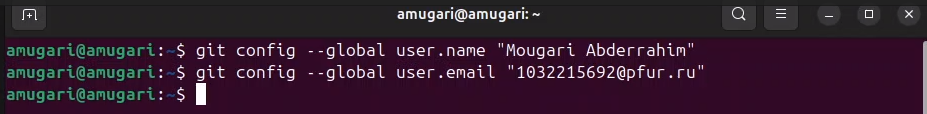{#fig:001 width=70%}

2. Параметры установки окончаний строк

- Настройка core.autocrlf с параметрами true и input делает все переводы строк текстовых файлов в главном хранилище одинаковыми в случае, если в нашем хранилище есть несколько пользователей с разными операционными системами (рис. [-@fig:002]).

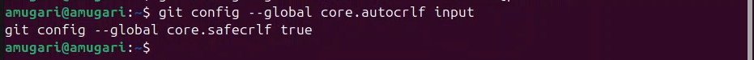{#fig:002 width=70%}

3. Установка отображения unicode

- Поскольку git будет печатать символы, отличные от ASCII, в именах файлов в виде восьмеричных последовательностей \**nnn**, нам пришлось установить этот флаг, чтобы избежать проблемы с удобочитаемостью (рис. [-@fig:074]).

{#fig:074 width=70%}

4. Создание страницы «Hello, World»

- Здесь мы создали пустую директорию с именем "hello", затем авторизуемся и создаем там файл с именем hello.html (рис. [-@fig:003]).

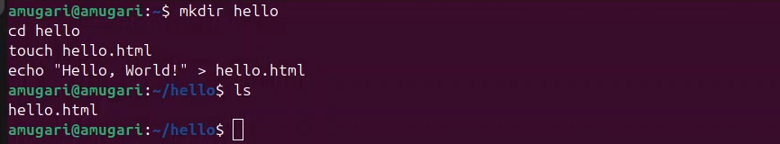{#fig:003 width=70%}

5. Cоздание репозитория и обавление файла в репозитори

- После этого мы создали репозиторий и сделали в нем нашу первую фиксацию после добавления файла hello.html (рис. [-@fig:004]).

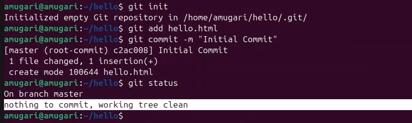{#fig:004 width=70%}

6. Внесение изменений

- добавили несколько HTML-тегов к нашему приветствию. Изменили содержимое файла hello.html (рис. [-@fig:005]).

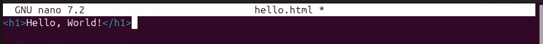{#fig:005 width=70%}

- git знает, что файл hello.html был изменен, но при этом эти изменения еще не зафиксированы в репозитории (рис. [-@fig:006]).

- вот почему мы добавили изменения в hello.html и они были проиндексированы. Это означает, что git в настоящее время знает об изменениях, но они еще не были зарегистрированы в репозитории. (рис. [-@fig:006]).

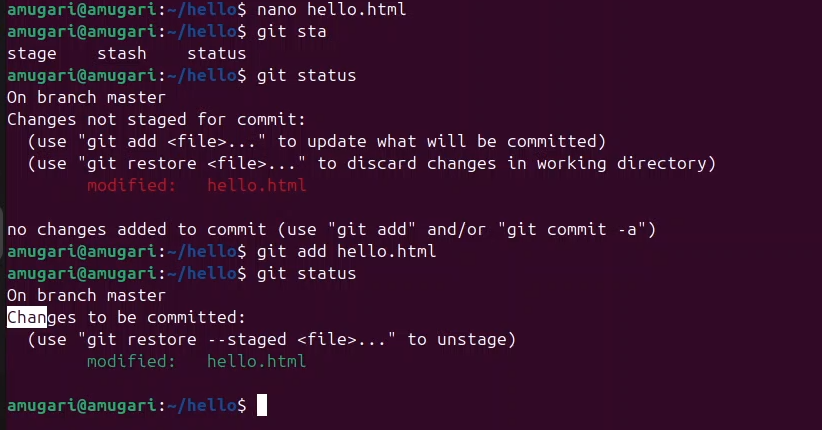{#fig:006 width=70%}

7.  Коммит изменени

- мы убрали метку m из командной строки, git перенес нас в редактор по нашему выбору. мы выполнили фиксацию и проверили статус (рис. [-@fig:007]).

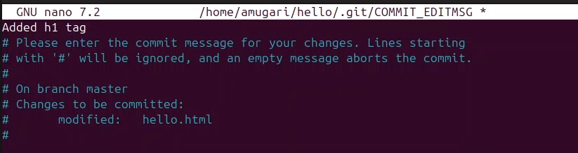{#fig:007 width=70%}

8. добавление стандартных тегов страницы 

- мы изменили страницу "Привет, мир", чтобы она содержала стандартные теги <html> (рис. [-@fig:008]).

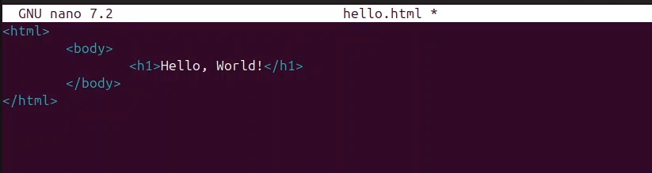{#fig:008 width=70%}

- затем добавил это изменение в индекс git (рис. [-@fig:009]).

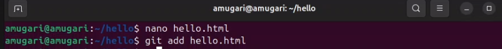{#fig:009 width=70%}

- затем добавил аголовки HTML (секцию <head>) к странице «Hello, World». (рис. [-@fig:010]).

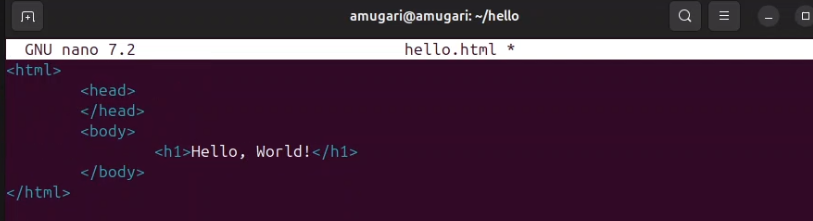{#fig:010 width=70%}

- здесь мы можем отметить, что hello.html он дважды указан в статусе. Первое изменение (добавление стандартных тегов) было проиндексировано и готово к фиксации. Второе изменение (добавление HTML-заголовков) не проиндексировано. и он должен быть проиндексирован, прежде чем сможет быть зафиксирован (рис. [-@fig:011]).

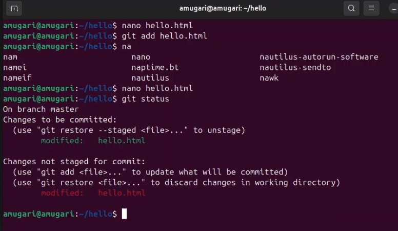{#fig:011 width=70%}

- вот почему мы зафиксировали индексированное изменение (значение по умолчанию), кроме того, я добавил второе изменение в индекс и проверил статус с помощью команды git status. (рис. [-@fig:012]).

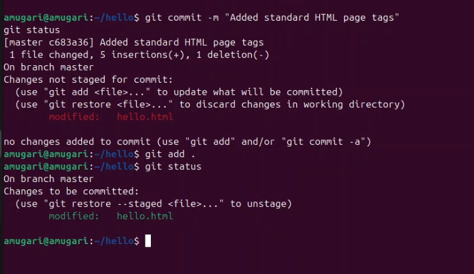{#fig:012 width=70%}

9. История

- мы получили список внесенных изменений (рис. [-@fig:013]).

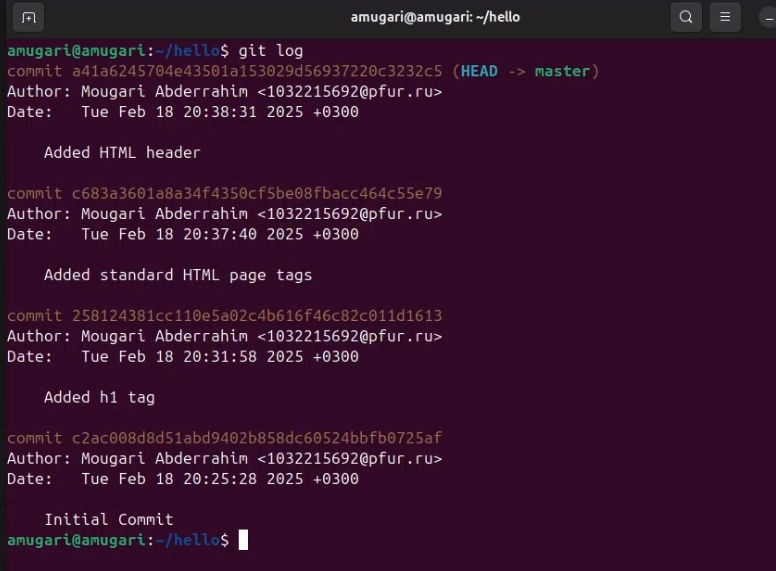{#fig:013 width=70%}

10. Получение старых версий

- мы получили хэши предыдущих версий с помощью команды checkout , а затем мы вернулись во времени к первому коммиту (рис. [-@fig:014]).

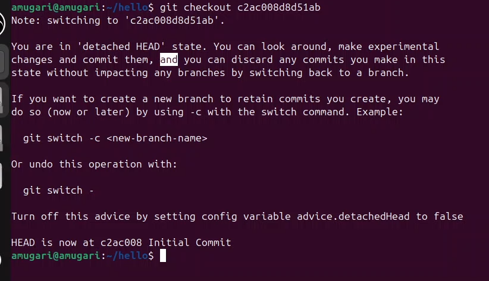{#fig:014 width=70%}

- затем, мы проверили файл hello.html и это выглядит так, как будто мы не вносили в него никаких изменений (рис. [-@fig:015]).

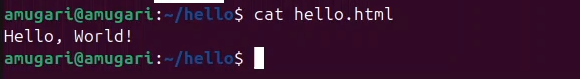{#fig:015 width=70%}

11. Создание тегов версий

- Здесь мы создали новый тег для последней версии, а затем перешли к его родительской версии, которая была непосредственно предшествующей (рис. [-@fig:016]).

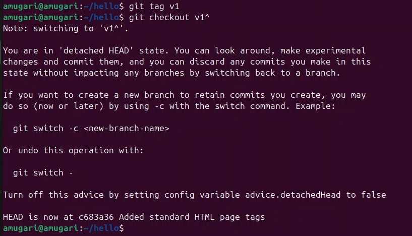{#fig:016 width=70%}

- в родительской версии мы проверили файл hello.html и там отсутствуют теги head, что правильно (рис. [-@fig:017]).

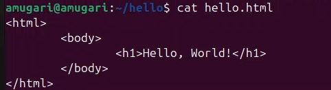{#fig:017 width=70%}

- мы назвали эту версию v1-бета-версией (рис. [-@fig:018]).

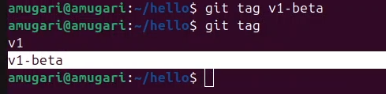{#fig:018 width=70%}

- мы можем видеть теги (v1 и v1-бета) в журнале вместе с названием ветки (master).
Кроме того, в заголовке отображается коммит, на который вы перешли (на данный
момент это v1-бета). (рис. [-@fig:019]).

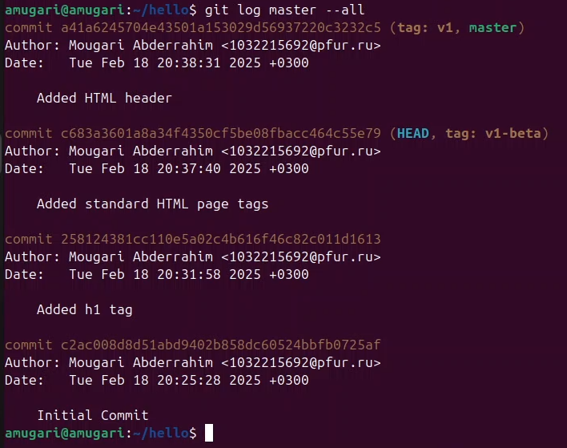{#fig:019 width=70%}

12. Отмена локальных изменений (до индексации)

- Внес изменения в файл hello.html в виде нежелательного комментария  (рис. [-@fig:020]).

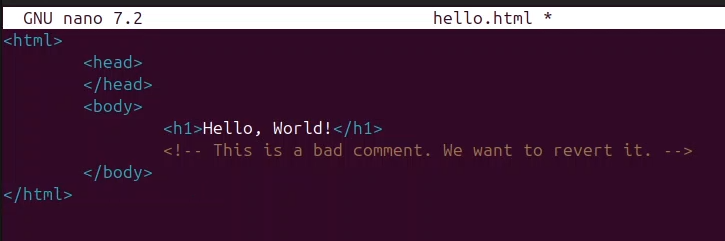{#fig:020 width=70%}

- Мы проверели статус каталога ,hello.html он был изменен, но не проиндексирован (рис. [-@fig:021]).

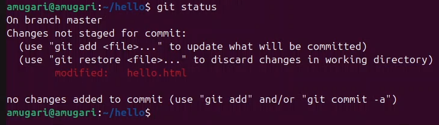{#fig:021 width=70%}

- Используя команду git checkout, мы изменили версию файла. hello.html в репозитории а команда "статус" подтверждает, что изменения были отменены и ожидающие изменения недоступны (рис. [-@fig:022]). 

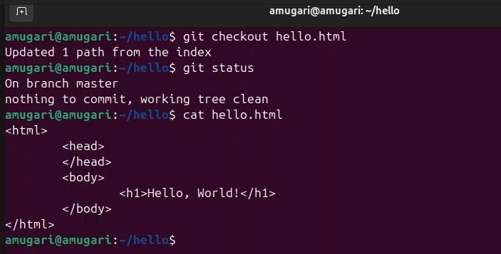{#fig:022 width=70%}

13. Oтмена проиндексированных изменений (перед коммитом

- Внес изменения в файл hello.html в виде нежелательного комментария  (рис. [-@fig:023]).

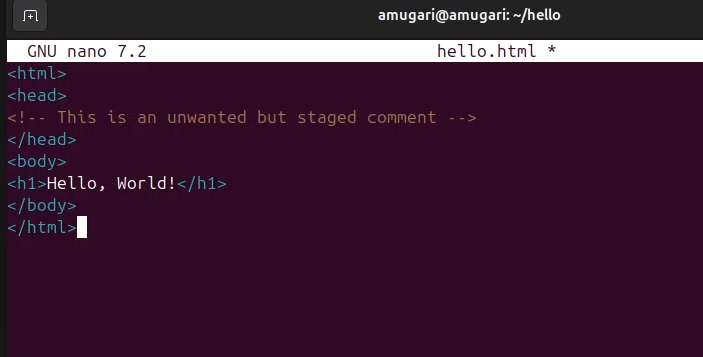{#fig:023 width=70%}

- но в данном случае мы проиндексировали это изменение, но не выполнили фиксацию (рис. [-@fig:024]).

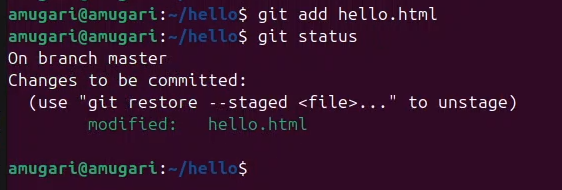{#fig:024 width=70%}

- Команда git reset сбрасывает буферную зону к HEAD. Это очищает буферную
зону от изменений, которые мы только что проиндексировали (рис. [-@fig:025]).

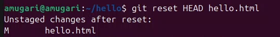{#fig:025 width=70%}

- Наш рабочий каталог опять чист (рис. [-@fig:026]).

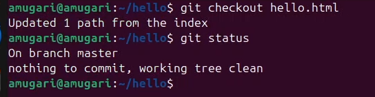{#fig:026 width=70%}

14. Отмена коммитов

- Внес изменения в файл hello.html в виде нежелательного комментария  (рис. [-@fig:027]).

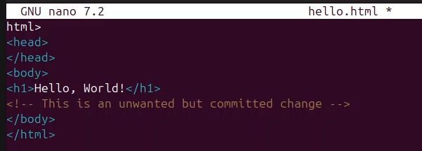{#fig:027 width=70%}

- я проиндексировал изменения и выполнил commit в репозитории  (рис. [-@fig:028]).

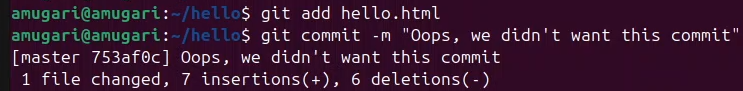{#fig:028 width=70%}

- мы отменили самую последнюю фиксацию, мы смогли использовать HEAD в качестве аргумента для отмены. (рис. [-@fig:029]).

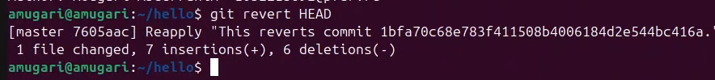{#fig:029 width=70%}

 15. Удаление коммиттов из ветки
 
 - отметил последнюю коммит тегом , чтобы мы могли найти ее позже (рис. [-@fig:030]).
 
 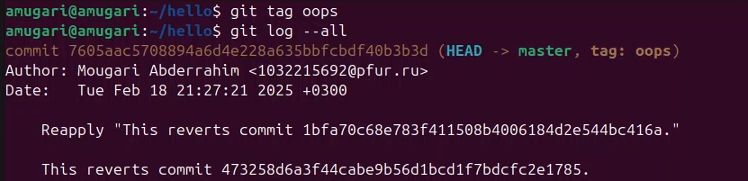{#fig:030 width=70%}
 
 - восстановил ветку до этого состояния. Поскольку у ветки есть тег, мы использовали название тега в команде сброса (рис. [-@fig:031]).

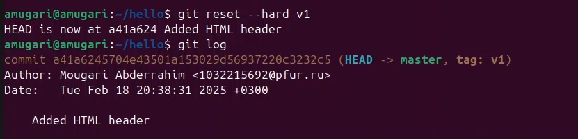{#fig:031 width=70%}
 
 - Kоммиты все еще находятся в репозитории. (рис. [-@fig:032]).
 
 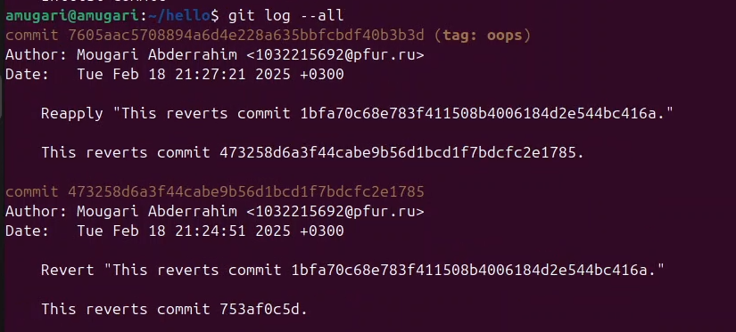{#fig:032 width=70%}
 
 16. Удаление тега oops
 
 - мы удалили коммит и тег, на который он ссылался, с помощью сборщика мусора (рис. [-@fig:033]).
 
  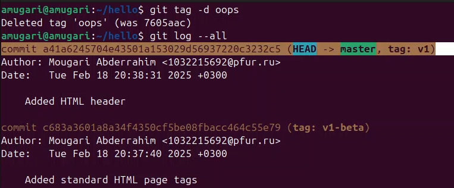{#fig:033 width=70%}
 
 17. Внесение изменений в коммиты
 
 - здесь мы изменили страницу, а затем выполнили commit. затем мы захотели добавить email к предыдущему commit, поэтому мы используем опцию --amend, чтобы сделать это, как показано на рисунке (рис. [-@fig:034]).
 
   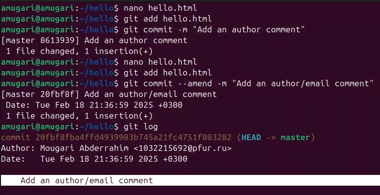{#fig:034 width=70%}
   
18. Перемещение файлов

- здесь мы создали новый каталог lib и, используя команду git mv, смогли не только переместить файл hello.html но и немедленно проиндексировать изменения, после чего мы выполнили фиксацию (рис. [-@fig:035]).

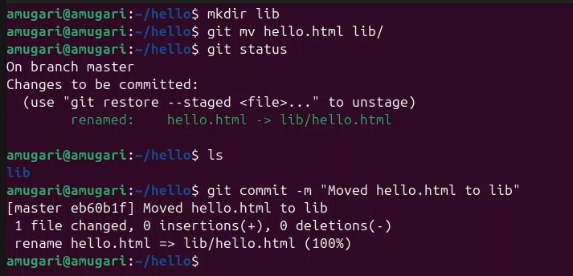{#fig:035 width=70%}

19. Добавление index.html

- Добавил файл index.html в наш репозиторий (рис. [-@fig:036]).

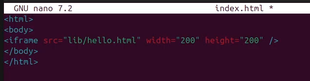{#fig:036 width=70%}

- и вот как сейчас выглядит наша страница (рис. [-@fig:037]).

{#fig:037 width=70%}

20. Git внутри: Каталог .git

- используя первую команду, мы открываем каталог, где хранится вся информация, они ввели объекты, где мы нашли каталоги, которые состоят из 2 символов. -
на этот раз они оказываются первыми двумя буквами хэша объекта, расположенного в git, после чего мы выбрали один из них и Я ввел его и нашел файл с названием из 38 символов, информация в нем сжата и закодирована, поэтому просмотр их содержимого нам мало чем поможет (рис. [-@fig:038]).

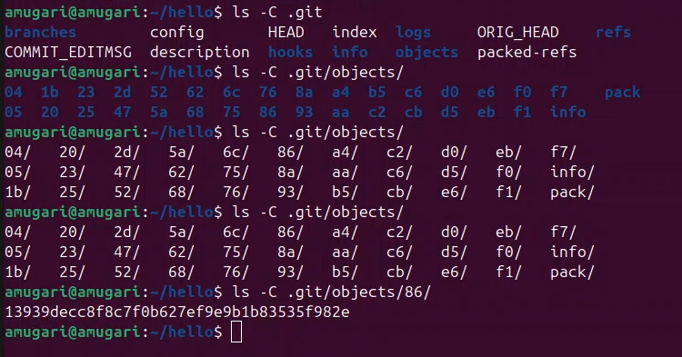{#fig:038 width=70%}

-мы проверили конфигурационный файл, который создается для каждого проекта и еще смогли найти теги, ветки и head git, в нашем случае у нас есть только одна ветка **master** (рис. [-@fig:039]).

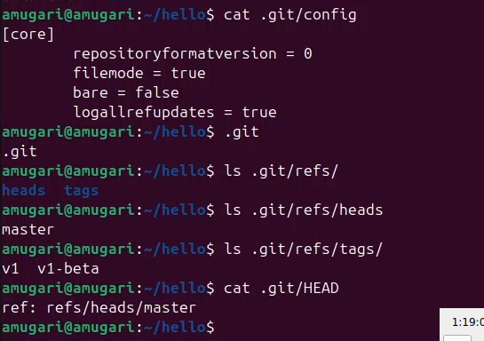{#fig:039 width=70%}

21. Работа непосредственно с объектами git

- мы получили последнюю фиксацию в репозитории (рис. [-@fig:040]).

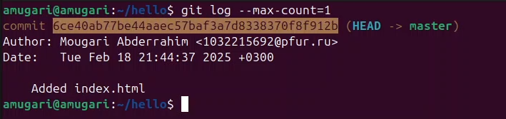{#fig:040 width=70%}

- затем мы получили последнюю фиксацию, но с использованием хэша SHA1 (рис. [-@fig:041]).

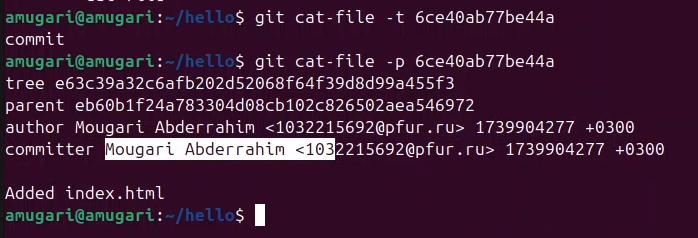{#fig:041 width=70%}

- затем мы отобразили дерево каталогов, ссылка на который идет в коммите. (рис. [-@fig:042]).

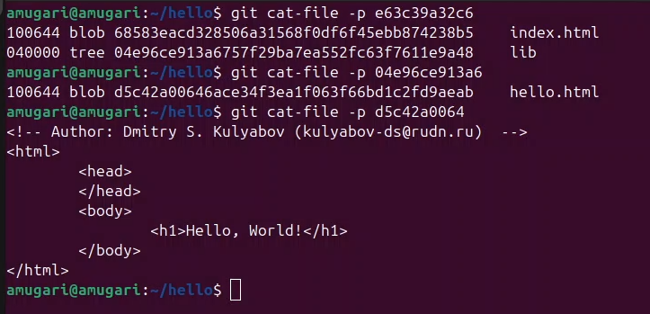{#fig:042 width=70%}

21. поиск исходного файла hello.html

- затем мы автоматически начали поиск исходного файла hello.html , это был итерационный процесс, и после некоторого поиска мы добрались до исходного файла (рис. [-@fig:043]).

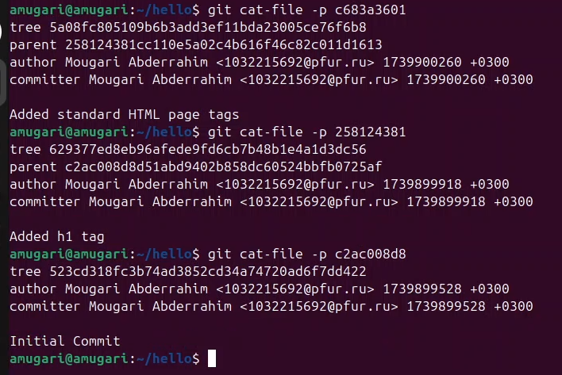{#fig:043 width=70%}

22. Создание ветки

- здесь мы создали новую ветку под названием style (рис. [-@fig:044]).

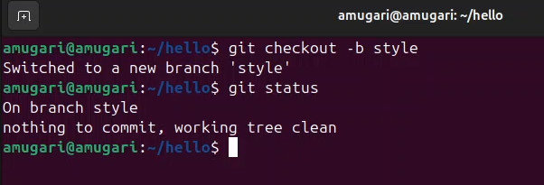{#fig:044 width=70%}

- затем мы создали новый файл для таблицы стилей style.css, после чего проиндексировали изменения и выполнили фиксацию (рис. [-@fig:045]).

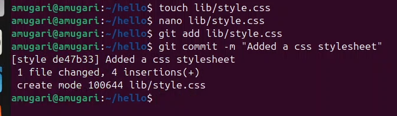{#fig:045 width=70%}

- мы обновили файл hello.html, чтобы использовать стили style.css (рис. [-@fig:046])

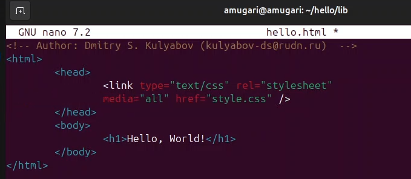{#fig:046 width=70%}

- затем мы обновили файл index.html так, чтобы он также использовал style.css, и, проверяя историю, мы можем видеть, что все коммиты находятся в ветке style (рис. [-@fig:047]).

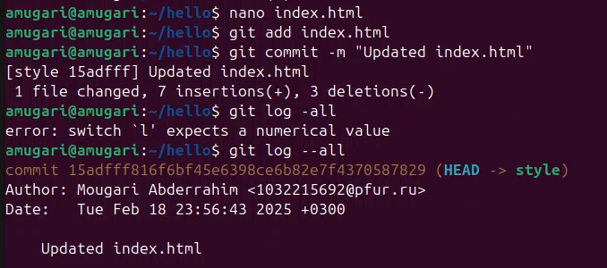{#fig:047 width=70%}

- мы перешли в ветку master и прочитали файл hello.html мы заметили, что в этой ветке не было внесено никаких изменений (файл hello.html не использует стили style.css.)  (рис. [-@fig:048]) 

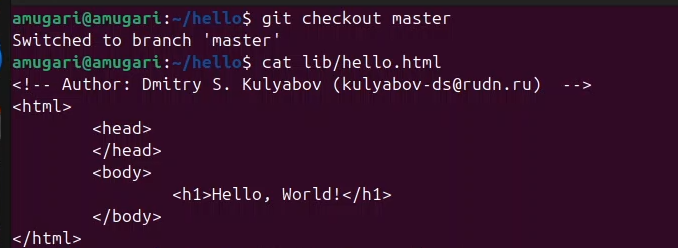{#fig:048 width=70%}

23. Изменения в ветке master

- мы создали файл README.md в ветке master, проиндексировали изменения и выполнили commit (рис. [-@fig:049]) 

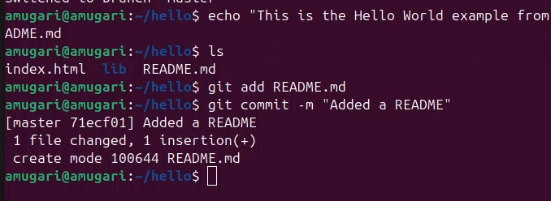{#fig:049 width=70%}

24. Просмотр отличающихся веток

- Теперь у нас в репозитории есть две отличающиеся ветки.  которые не связаны и не обновляются друг с другом (рис. [-@fig:050]) 

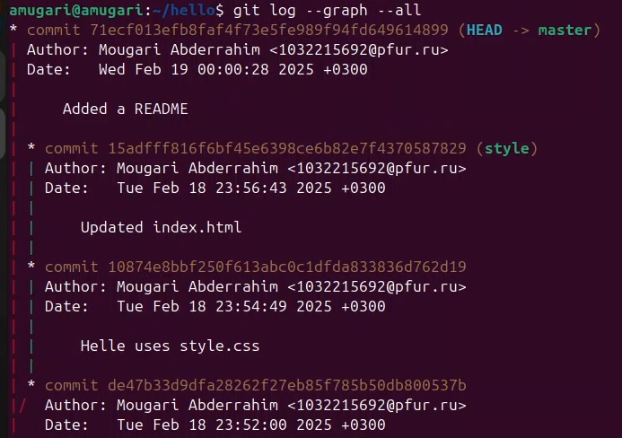{#fig:050 width=70%}

25. Cлияние веток

- здесь мы объединили ветку "master" с веткой "style" (рис. [-@fig:051]) 

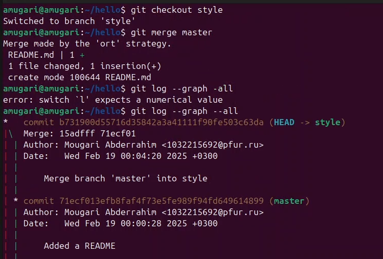{#fig:051 width=70%}

26. Создание конфликта

но, делая cлияние, мы иногда можем столкнуться с конфликтами, например, мы вернулись к основной ветке и изменили содержимое hello.html проиндексировали изменения и выполнили commit, что вызвало конфликт между двумя ветвями (рис. [-@fig:052]) 

{#fig:052 width=70%}

27. Разрешение конфликтов

- Мы попытались объединить ветку `master` с веткой `style`, но столкнулись с конфликтом в файле `hello.html`. Git не смог автоматически выполнить слияние, так как обе ветки содержат изменённые версии этого файла. В результате содержимое `hello.html` теперь содержит конфликтующие блоки кода (рис. [-@fig:053]).

{#fig:053 width=70%}

28. Разрешение конфликта вручную

- Открываем файл `hello.html`, в котором Git пометил конфликтные участки.  (рис. [-@fig:054]).
- Мы выбираем, какие изменения оставить, а какие удалить, чтобы получить корректную версию файла.
- После внесения правок сохраняем файл и добавляем его в индекс с помощью `git add`. 
- Проверяем статус репозитория (`git status`), чтобы убедиться, что конфликт разрешён

{#fig:054 width=70%} 

29. Завершение слияния

- После успешного разрешения конфликта выполняем коммит (`git commit -m "Merged master, resolved conflict"`).
- Проверяем историю коммитов (`git log --graph --all`), чтобы убедиться, что слияние завершено (рис. [-@fig:055]).

{#fig:055 width=70%}

### 30. Сброс ветки style  

- Возвращаем ветку `style` к состоянию перед слиянием (`git reset --hard`) (рис. [-@fig:056]).

{#fig:056 width=70%}

### 32. Сброс ветки master  

- Возвращаем ветку `master` к предыдущему состоянию, чтобы избежать конфликтов (рис. [-@fig:057]).

{#fig:057 width=70%}

### 33. Перебазирование  

- Выполняем `git rebase master`, чтобы применить изменения `master` к `style` (рис. [-@fig:058]).

{#fig:058 width=70%}

### 34. Слияние в ветку master  

- Завершаем процесс слиянием `style` в `master` (`git merge style`) (рис. [-@fig:059])

{#fig:059 width=70%}

- росмотрили логи (рис. [-@fig:060])

{#fig:060 width=70%}

### 35. Клонирование репозитория  

- Создаём копию репозитория с `git clone` (рис. [-@fig:061]).

{#fig:061 width=70%}

### 36. Изменение оригинального репозитория  

- Вносим изменения в `README.md` и коммитим их (рис. [-@fig:062]).

{#fig:062 width=70%}

### 37. Извлечение и слияние изменений  

- Используем `git fetch` и `git merge` для обновления локальной версии (рис. [-@fig:063]).

{#fig:063 width=70%}

### 38. Добавление ветки наблюдения  

- Настраиваем отслеживание удалённой ветки (`git branch --track`) (рис. [-@fig:064]).

{#fig:064 width=70%}

### 39. Чистый репозиторий  

- Создаём чистый репозиторий (`git clone --bare`) (рис. [-@fig:065]).

{#fig:065 width=70%}

### 40. Работа с удалёнными репозиториями  

- Добавляем удалённый репозиторий и отправляем изменения (`git push`) (рис. [-@fig:066]).

{#fig:066 width=70%}

### 41. Извлечение изменений из общего репозитория  

- Используем `git pull` для синхронизации (`git remote add shared`) (рис. [-@fig:067]).

{#fig:067 width=70%}

# Выводы

- в этой лабораторной работе мы получили глубокое представление о том, как работает git, его командах и сценариях, с которыми мы можем столкнуться при его использовании, а также о том, как их исправить. 

Более подробно про Unix см. в [@chacon_book_progit_en; @loeliger_book_versioncontrolgit_en]

# Список литературы{.unnumbered}

::: {#refs}
:::
